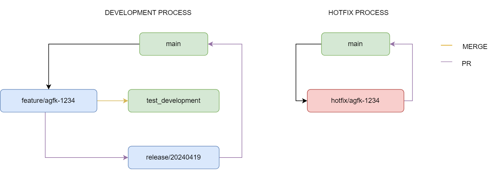

# Gitflow

## Branches
- `master`: Contains the code of the current production version.
- `develop`: Development branch where new features and fixes are integrated.
- `feature`: Temporary branches used for developing new features.
- `hotfix`: Branches created to fix critical bugs in the production version.
- `release`: Branch prepared to launch a new production version, allowing for minor adjustments.